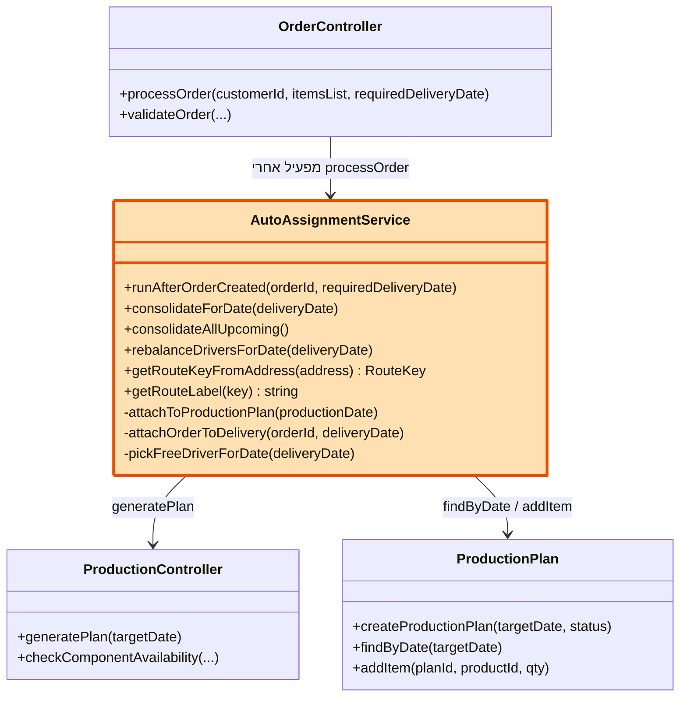
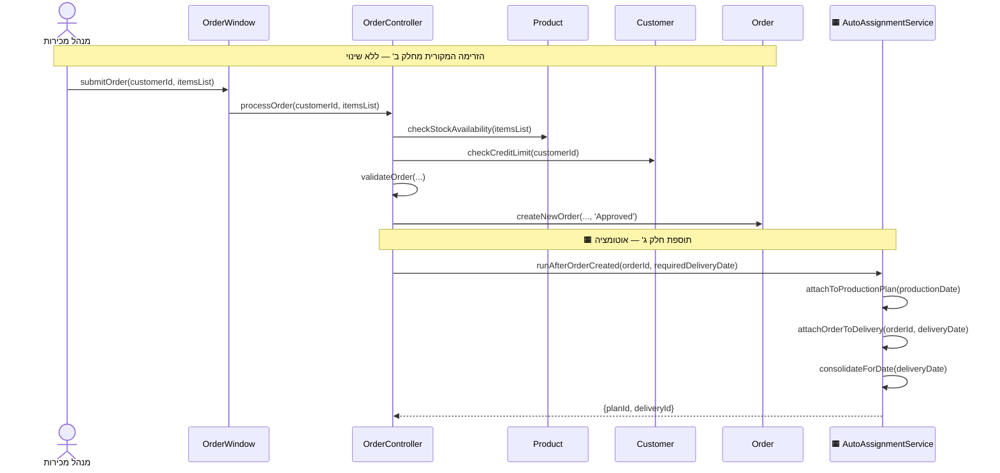
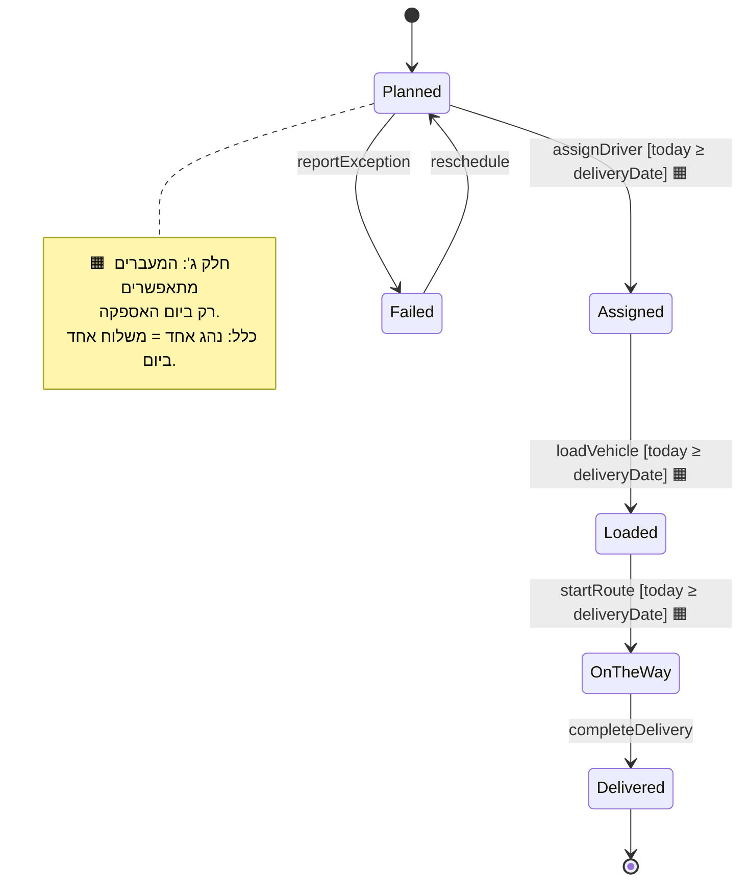

# ד״ר פיתה — עדכוני תרשימים (חלק ג')

> מסמך זה מוגש בהתאם לסעיף 2 בהוראות חלק ג':
> *"אם במהלך הקידוד גיליתם שהעיצוב מחלק ב' אינו מדויק או אינו שלם – עליכם לתקן את
> התרשימים... סמנו את השינויים שביצעתם."*
>
> במהלך הפיתוח גילינו מספר פערים בין התכנון המקורי לבין הצרכים העסקיים האמיתיים של
> המאפייה. להלן כל גילוי, ההחלטה שהתקבלה, והתיקון — ובסוף התרשימים המעודכנים עם
> סימון התוספות (🟧 = נוסף בחלק ג').
>
> **המהות בקצרה:** הוספנו **מחלקת שירות אחת** (`AutoAssignmentService`) שמתזמרת את
> הזרימות הקיימות, ו**תנאי שמירה אחד** (guard) על מעברי המשלוח. ליבת שלוש הדרישות
> (FR1/FR2/FR3) — אותן מחלקות, אותן שיטות, אותן הודעות — **ללא שינוי כלל**.

---

## חלק א' — הגילויים והתיקונים

### גילוי 1 — תכנון הייצור והשיוך למשלוח היו ידניים מדי

**בשלב הפיתוח גילינו ש**־ לפי התכנון המקורי, מנהל הייצור צריך ללחוץ ידנית "הפק
תוכנית" לכל יום, ומישהו צריך לשייך כל הזמנה למשלוח ידנית. במאפייה שמקבלת עשרות
הזמנות ביום זה לא מעשי, ועלול לגרום לכך שהזמנה תיקלט אך לא תיכלל בייצור או תישאר
בלי משלוח.

**אז החלטנו ל**־ להוסיף **מחלקת שירות אחת**, `AutoAssignmentService`, שמופעלת
אוטומטית מיד לאחר שהזמנה מאושרת, ומבצעת: (א) שיבוץ לתוכנית הייצור של היום המתאים,
(ב) שיוך למשלוח.

**התיקון:** נוספה המחלקה `AutoAssignmentService`, ובתרשים ה-Sequence של FR1 נוספה
קריאה ל-`runAfterOrderCreated()` מיד אחרי `processOrder()`. הזרימה המקורית (בדיקת
מלאי, בדיקת אשראי, יצירת הזמנה) **נותרה ללא שינוי** — רק נוספה שכבה מעליה.

---

### גילוי 2 — הזמנות לאזור קרוב נשלחו במשאיות נפרדות

**בשלב הפיתוח גילינו ש**־ שתי הזמנות לשני לקוחות באותו אזור (למשל רמלה ולוד) נוצרו
כשני משלוחים נפרדים — בזבוז של נהג, רכב ודלק. בנוסף, לפעמים אותו נהג שובץ לשני
משלוחים באותו יום.

**אז החלטנו ל**־ לקבץ הזמנות לפי **קו חלוקה גאוגרפי** (לפי כתובת הלקוח), כך שכל
ההזמנות באותו אזור ובאותו יום מאוחדות למשלוח אחד; ולאכוף את הכלל **נהג אחד = משלוח
אחד ביום**.

**התיקון:** נוסף לוגיקת הקיבוץ **כשיטות נוספות בתוך `AutoAssignmentService`**
(`consolidateForDate`, `getRouteKeyFromAddress`, `rebalanceDriversForDate`) — לא
נוצרה מחלקה נפרדת, כדי לשמור על מחלקה חדשה אחת בלבד בתרשים.

---

### גילוי 3 — אפשר היה לקדם משלוח לפני יום האספקה

**בשלב הפיתוח גילינו ש**־ ניתן היה לסמן משלוח כ"בדרך" או "נמסר" עוד לפני שהגיע יום
האספקה שלו — דבר שאינו הגיוני תפעולית.

**אז החלטנו ל**־ לנעול את ניהול המשלוח עד ליום האספקה: מעברי הסטטוס מתאפשרים רק
ביום עצמו.

**התיקון:** בתרשים ה-State של המשלוח נוסף **תנאי שמירה (guard)** על המעברים:
`[today ≥ deliveryDate]`. **לא נוספו מצבים חדשים ולא מעברים חדשים** — אותם 6 מצבים
בדיוק, רק עם תנאי מתי הם מותרים. זהו רכיב סטנדרטי ב-UML.

---

## חלק א׳.1 — מה שהתברר שכבר מתאים לתכנון (ללא שינוי תרשים)

### ייצור בלילה שלפני האספקה
במאפייה הפיתות נאפות בלילה ויוצאות בבוקר שלמחרת. לכן תוכנית ייצור של יום מסוים
מייצרת את ההזמנות שצריך לספק למחרת. **זו אינה תוספת לתרשים** — זו פרשנות של
הפרמטר `targetDate` בשיטה הקיימת `generatePlan(targetDate)`. השיטה, ההודעה
והמחלקה — כולן כבר קיימות בתרשים מחלק ב'.

---

## חלק ב' — התרשימים המעודכנים (🟧 = תוספת חלק ג')

### תרשים מחלקות — מחלקה חדשה אחת

> 🟧 התיבה הכתומה (`AutoAssignmentService`) היא **התוספת היחידה** לתרשים המחלקות.
> כל השאר היה קיים בחלק ב'. לוגיקת קיבוץ הקווים נמצאת בתוך מחלקה זו (שיטות
> `getRouteKeyFromAddress` / `getRouteLabel`).

---

### Sequence Diagram — FR1 (קליטת הזמנה)

> 🟧 רק הבלוק התחתון (אחרי יצירת ההזמנה) נוסף. כל מה שמעליו — זהה לחלק ב'.
> **שימו לב:** ב-FR2 וב-FR3 **אין שום שינוי** — מיפוי 1:1 לתרשים המקורי.

---

### State Diagram — Delivery (תוספת guard בלבד)

> 🟧 אותם 6 מצבים ואותם מעברים מחלק ב' — נוסף רק **תנאי השמירה** `[today ≥ deliveryDate]`.

---

## חלק ג' — סיכום: מה השתנה ומה לא

| נושא | חלק ב' (מקורי) | חלק ג' (מעודכן) |
|------|----------------|------------------|
| **3 הדרישות (FR1/2/3)** | ✅ | **ללא שינוי** — אותן מחלקות, שיטות והודעות |
| מחלקות | מודולים 1-3 | + מחלקה אחת: `AutoAssignmentService` 🟧 |
| תכנון ייצור + שיוך משלוח | ידני | + הפעלה אוטומטית (בתוך השירות) |
| State של משלוח | 6 מצבים | אותם 6 מצבים + guard תאריך 🟧 |
| ייצור יום לפני אספקה | — | פרשנות של `generatePlan(targetDate)` (לא שינוי) |

**המסר להצגה:** *"לא שינינו דבר מליבת שלוש הדרישות. בשלב הפיתוח גילינו שהפלואו הידני
לא מספיק למאפייה אמיתית, אז הוספנו מחלקת שירות אחת שמתזמרת את הזרימות הקיימות —
מסומנת בכתום בתרשים — ותנאי שמירה אחד על המשלוח."*
